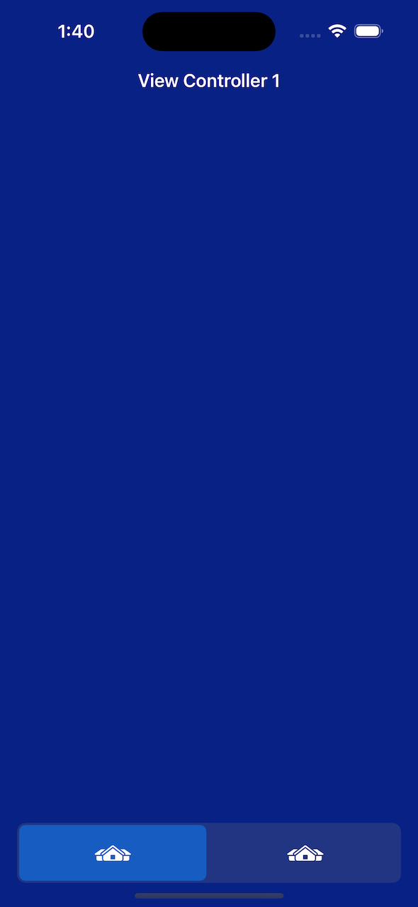
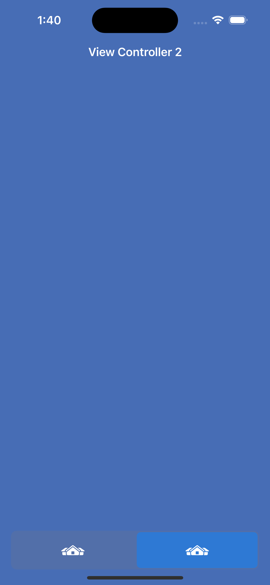

# About

Segemented Tab is an example project showing the use of UISegmentControl replacing UITabBar for a UITabBarController. 


Tab 1            |  Tab 2
:-------------------------:|:-------------------------:
 |  


# Features

(Features not applicable)

# Requirements

This project was developed with the following environment:

- Xcode Version 15.2
- Swift 5

# Installation

(Installation not applicable)

# Usage

The segments act similarly just like tab


Open the project in Xcode.

Open the file MainTabBarController.swift

Modify the "icons" constant list of the images for the segmented tab bars

```swift
    private let icons: [String] = [
                                "house.lodge.fill",
                                "house.lodge.fill"
    ]
```


In the overridden function viewDidLoad(), add each view controller as needed to the viewController.

```swift
    override func viewDidLoad() {
        super.viewDidLoad()

        // First View Controller     
        let navc1 = UINavigationController()
        let vc1 = ViewController1()
        navc1.viewControllers.append(vc1)
        
        // Second View Controller
        let navc2 = UINavigationController()
        let vc2 = ViewController2()
        navc2.viewControllers.append(vc2)
        
        // Append all view controllers
        self.viewControllers = [navc1, navc2]
        
        // Hide the original tab bar
        self.tabBar.isHidden = true
    }
```

(Optional)

In the function "InitializeTab" function, you can modify the color for the segmented control


# Supporters 

(Supporters not applicable)

# License

(License not applicable)